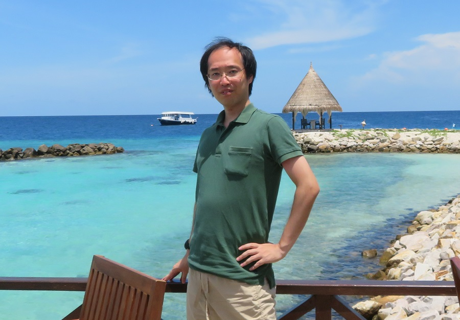

# プログラミング創造研究所

## 研究所について

プログラミング創造研究所は、ソフトウェア開発の未来を探求する個人研究開発機関です。純粋な技術的興味と社会的価値の両立を目指した研究開発を行っています。

## ミッション
- プログラミングを楽しく効率的に行えるようにする
- 誰もがプログラミングによって創造性を発揮できる技術教育の環境を築く

## アプローチ
- 技術的興味に基づく自由な研究開発
- 実践的な知識・経験の社会還元
- 技術を通じた教育・メンタリング

## 活動内容
### (1)研究開発
現在、以下の領域で研究開発を進めています：
- プログラム理解・デバッグ支援技術
- 生成AI活用による開発やプログラミング学習の支援

### (2)技術情報発信
プログラミングの普及と学習支援のために初心者向け技術ブログ執筆、動画による解説を行っています。大学で外部講師としてソフトウェア工学に関する講演も実施しています。

### (3)メンタリング
開発者の成長支援のため、少人数制の個別メンタリングを行っています。

## 代表プロフィール

### 丹野 治門 (Haruto Tanno)
- 博士（工学）
- NTT研究所で技術者・マネージャ（15年以上）、学生時代は学習塾で非常勤講師（約4年間）、大学外部講師
- 論文発表：100本以上（トップ国際会議での発表含む）、特許出願：国内50本・米国20本以上、国内外での受賞：20件以上
- 専門分野
  - ソフトウェアテスト自動化
  - デバッグ支援技術
  - 生成AI活用ソフトウェア開発
  - C#プログラミング

（経歴・業績の詳細については[こちら](https://haruto8tanno.github.io/)をご覧ください）

## 仕事の依頼
### 検討可能な事項
- 技術講演（大学外部講師等）
- 専門性の高い技術アドバイザリー
- 少人数制のメンタリング
### ご留意事項
- 現在の研究開発活動との親和性を重視します
- 時期や状況によってお引き受けできない場合がございます

## お問い合わせ
- ｈａｒｕｔｏ．ｔａｎｎｏ．ｐｂ【at】ｇｍａｉｌ．ｃｏｍ
- ※お手数ですが、全角文字を半角文字にした上で【at】を@に置き換えてご利用ください。